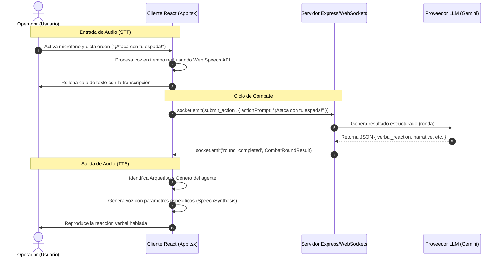

# Diseño de Implementación: Fase 4 - Audio y Voz Bidireccional

Este documento establece la arquitectura, especificaciones técnicas y la guía de desarrollo para implementar la **Fase 4** en **Battle Agents**. El objetivo es habilitar la interacción de voz bidireccional entre el operador (usuario) y los agentes de inteligencia artificial en combate.

---

## 1. Objetivos del Sistema de Audio

1. **Entrada de Voz (Speech-to-Text):** Permitir al operador dictar las órdenes de combate mediante su micrófono, transcribiendo automáticamente su voz a prompts de acción en el cliente web.
2. **Salida de Voz (Text-to-Speech):** Dotar de voz física a las respuestas de diálogo (`verbal_reaction`) de los agentes, ajustando el tono, el ritmo y el género del audio en función del arquetipo de personalidad del personaje.
3. **Sincronización en Tiempo Real:** Garantizar que la reproducción de voz ocurra simultáneamente al despliegue de las narrativas en el log del juego.

---

## 2. Flujo de Datos (Arquitectura)

Para no interferir con las reglas, modificadores de mapas o boosters gestionados por el `CombatEngine` en el servidor, las APIs de audio se integran de manera modular sobre la conexión WebSocket existente:



---

## 3. Comparativa de Enfoques Técnicos

| Enfoque | Descripción | Pros | Contras |
| :--- | :--- | :--- | :--- |
| **Opción A: Web Speech API (Nativo)** | Usa las capacidades integradas del navegador del usuario. | • Gratis.<br>• Latencia cero (<100ms).<br>• Sin dependencias de red adicionales. | • La calidad de la voz varía según el sistema operativo del usuario. |
| **Opción B: APIs de Voz en la Nube (ElevenLabs / Whisper)** | Transcripción y síntesis mediante endpoints HTTP de terceros en el servidor. | • Calidad de voz ultra-realista / premium.<br>• Voces idénticas en cualquier dispositivo. | • Costo monetario por carácter/minuto.<br>• Añade latencia de red (1.5s - 2.5s). |
| **Opción C: Gemini Multimodal Live API** | Conexión WebSocket directa de audio bidireccional con el modelo de Google. | • Experiencia conversacional fluida sin turnos rígidos. | • Requiere rediseñar el motor físico y de reglas del juego. |

> [!NOTE]  
> **Recomendación:** Implementar una **arquitectura híbrida progresiva**. La base del sistema se construirá sobre la **Opción A (Nativo)** para garantizar funcionalidad gratuita y de baja latencia. El diseño dejará preparados los conectores en el backend para poder activar la **Opción B (Voz Premium con ElevenLabs)** mediante variables de entorno en producción.

---

## 4. Guía de Implementación Técnica

### 4.1. Entrada de Audio (Speech-to-Text) en React
Añadiremos un botón de grabación en el panel de acciones que utilice `webkitSpeechRecognition` para rellenar el estado `playerActionPrompt` del cliente:

```typescript
// Componente de Reconocimiento de Voz
export const startVoiceCapture = (
  onResult: (text: string) => void,
  onError: (err: string) => void,
  onStateChange: (listening: boolean) => void
) => {
  const SpeechRecognition = (window as any).SpeechRecognition || (window as any).webkitSpeechRecognition;
  if (!SpeechRecognition) {
    onError("El navegador no soporta reconocimiento de voz.");
    return null;
  }

  const recognition = new SpeechRecognition();
  recognition.lang = 'es-ES';
  recognition.interimResults = false;
  recognition.continuous = false;

  recognition.onstart = () => onStateChange(true);
  recognition.onend = () => onStateChange(false);
  recognition.onerror = (event: any) => onError(`Error STT: ${event.error}`);
  
  recognition.onresult = (event: any) => {
    const transcript = event.results[0][0].transcript;
    onResult(transcript);
  };

  recognition.start();
  return recognition;
};
```

### 4.2. Salida de Audio (Text-to-Speech) Personalizada
El sistema seleccionará parámetros de reproducción basados en el género y el arquetipo del agente.

```typescript
export const speakAgentReaction = (
  text: string, 
  gender: 'hombre' | 'mujer', 
  archetype: 'cobarde_sarcastico' | 'paladin_orgulloso' | 'ansioso_inseguro' | 'guerrero_pragmatico'
) => {
  if (!('speechSynthesis' in window)) return;

  // Interrumpir cualquier voz en reproducción activa
  window.speechSynthesis.cancel();

  const utterance = new SpeechSynthesisUtterance(text);
  utterance.lang = 'es-ES';

  // Configuración de la voz según el arquetipo de personalidad
  switch (archetype) {
    case 'cobarde_sarcastico':
      utterance.pitch = 1.25;  // Tono más agudo
      utterance.rate = 1.15;   // Velocidad ligeramente rápida
      break;
    case 'paladin_orgulloso':
      utterance.pitch = 0.85;  // Tono grave e imponente
      utterance.rate = 0.90;   // Velocidad pausada/solemne
      break;
    case 'ansioso_inseguro':
      utterance.pitch = 1.15;  // Tono nervioso
      utterance.rate = 1.35;   // Habla acelerada
      break;
    case 'guerrero_pragmatico':
    default:
      utterance.pitch = 1.00;  // Tono neutro y directo
      utterance.rate = 1.05;   // Velocidad estándar
  }

  // Filtrar voces del sistema que coincidan con el género e idioma
  const voices = window.speechSynthesis.getVoices();
  const esVoice = voices.find(v => {
    const isSpanish = v.lang.startsWith('es');
    const name = v.name.toLowerCase();
    
    const isMale = name.includes('male') || name.includes('david') || name.includes('pablo') || name.includes('julio');
    const isFemale = name.includes('female') || name.includes('helena') || name.includes('sara') || name.includes('zira');

    if (gender === 'hombre') return isSpanish && isMale;
    return isSpanish && isFemale;
  });

  if (esVoice) {
    utterance.voice = esVoice;
  }

  window.speechSynthesis.speak(utterance);
};
```

---

## 5. Checklist de Tareas para la Fase 4

### [ ] Preparación y UI (Frontend)
- [ ] Diseñar el botón de micrófono en la caja de entrada de acción (`client/src/App.tsx`).
- [ ] Añadir animaciones de oscilación/onda usando **Anime.js** o CSS cuando el micrófono esté en estado `listening`.
- [ ] Agregar un interruptor (Toggle) de audio general en la esquina de la interfaz para silenciar/activar las voces.

### [ ] Lógica de Captura (STT)
- [ ] Integrar el manejador de captura de voz nativa al hacer clic en el botón del micrófono.
- [ ] Enlazar el resultado del dictado al estado global del input de comandos.

### [ ] Lógica de Reproducción (TTS)
- [ ] Escuchar el evento de socket con el resultado de la ronda (`player_draft_status`, `resolvePvPRound`).
- [ ] Ejecutar la función de síntesis de voz pasándole el arquetipo, género y el `verbal_reaction` retornado para cada agente de combate en el log de la ronda.

### [ ] Integración de Configuración
- [ ] Añadir a la configuración de entorno (`.env` y `src/config.ts`) los flags para habilitar o deshabilitar la síntesis y permitir futuras integraciones de APIs en la nube.
