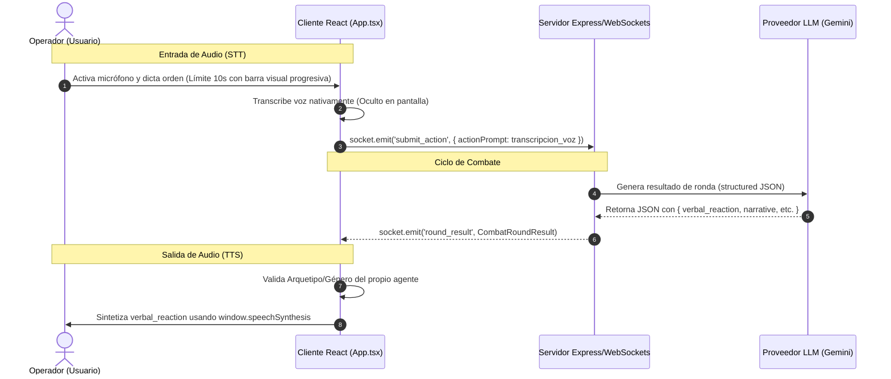

# Diseño de Implementación: Fase 4 - Audio y Voz Bidireccional

Este documento establece la arquitectura, especificaciones técnicas y la guía de desarrollo implementada para la **Fase 4** en **Battle Agents**. La Fase 4 habilita el dictado por voz de órdenes del operador (usuario) como opción prioritaria y la síntesis de voz de sus propios agentes con personalidad adaptada.

---

## 1. Objetivos del Sistema de Audio

1. **Entrada de Voz (Speech-to-Text) Prioritaria y Directa:** 
   - El operador dicta las órdenes de combate a través del micrófono.
   - El texto transcrito **no se muestra en pantalla** para simular una conexión mental real. Al detener la grabación (o transcurrir el tiempo límite), la orden se envía directamente al motor de combate.
   - Duración de grabación acotada a un máximo de **10 segundos** con un **limitador visual no numérico** en tiempo real.
   - Toggle para cambiar a modo de **Consola de Texto** manual si se prefiere usar teclado.
2. **Salida de Voz (Text-to-Speech) Exclusiva del Operador:** 
   - Reproducción física hablada de la respuesta verbal (`verbal_reaction`) del agente del jugador.
   - La síntesis de voz se modula según el **género** del agente y su **arquetipo de personalidad** (cambiando tono y velocidad de habla).
   - Se omite la voz del oponente/CPU para evitar ruidos cruzados y mantener el foco en la comunicación bidireccional entre el operador y su propio agente.

---

## 2. Flujo de Datos (Arquitectura)

La entrada y salida de audio están integradas nativamente en el flujo del cliente React (`App.tsx`), interactuando de forma asíncrona con el backend mediante peticiones REST y WebSockets:



---

## 3. Comparativa de Enfoques Técnicos

| Enfoque | Descripción | Pros | Contras |
| :--- | :--- | :--- | :--- |
| **Opción A: Web Speech API (Nativa) [IMPLEMENTADO]** | Utiliza el motor nativo del navegador del usuario. | • Gratis ($0).<br>• Latencia cero.<br>• Sin dependencias de red. | • La calidad de la voz varía según el sistema operativo del usuario. |
| **Opción B: APIs de Voz en la Nube (ElevenLabs / Whisper)** | Transcripción y síntesis mediante endpoints HTTP externos de pago. | • Calidad de voz ultra-realista premium.<br>• Voces idénticas en cualquier dispositivo. | • Costo monetario por uso.<br>• Añade latencia de red (1.5s - 2.5s). |
| **Opción C: Gemini Multimodal Live API** | Conexión WebSocket directa de audio bidireccional con el modelo de Google. | • Experiencia conversacional en tiempo real. | • Requiere omitir las reglas físicas estructuradas del motor. |

---

## 4. Detalles de Implementación Técnica en `App.tsx`

### 4.1. Entrada de Audio y Envío Directo (STT)
Cuando el usuario inicia la grabación de voz, se dibuja una barra de tiempo animada por CSS y se programa una auto-detención tras 10 segundos. Al recibir el resultado de voz, este se procesa e inmediatamente se transmite al motor:

```typescript
const startVoiceRecognition = () => {
  if (isFighting || isProcessingVoice) return;
  const SpeechRecognition = (window as any).SpeechRecognition || (window as any).webkitSpeechRecognition;
  if (!SpeechRecognition) {
    setErrorMsg("El navegador no soporta reconocimiento de voz nativo.");
    return;
  }

  if (isListening) {
    if (recordingTimeoutRef.current) {
      clearTimeout(recordingTimeoutRef.current);
      recordingTimeoutRef.current = null;
    }
    if (recognitionRef.current) {
      recognitionRef.current.stop();
    }
    return;
  }

  const rec = new SpeechRecognition();
  rec.lang = 'es-ES';
  rec.interimResults = false;
  rec.continuous = false;

  rec.onstart = () => {
    setIsListening(true);
    // Temporizador de 10s para detener la grabación automáticamente
    recordingTimeoutRef.current = setTimeout(() => {
      if (rec) {
        rec.stop();
      }
    }, 10000);
  };

  rec.onend = () => {
    setIsListening(false);
    if (recordingTimeoutRef.current) {
      clearTimeout(recordingTimeoutRef.current);
      recordingTimeoutRef.current = null;
    }
  };

  rec.onerror = (e: any) => {
    setIsListening(false);
    if (recordingTimeoutRef.current) {
      clearTimeout(recordingTimeoutRef.current);
      recordingTimeoutRef.current = null;
    }
  };

  rec.onresult = async (event: any) => {
    const transcript = event.results[0][0].transcript;
    if (transcript && transcript.trim()) {
      setIsProcessingVoice(true);
      try {
        // Envía el texto directamente sin escribirlo en un textarea
        await executeActionSubmission(transcript);
      } catch (err) {
        console.error("Error al transmitir por voz:", err);
      } finally {
        setIsProcessingVoice(false);
      }
    }
  };

  recognitionRef.current = rec;
  rec.start();
};
```

### 4.2. Barra Visual de Temporizador en CSS (`index.css`)
Durante la grabación activa (`isListening`), se renderiza una barra cyberpunk que se llena de `0%` a `100%` a lo largo de los 10 segundos exactos utilizando CSS Keyframes:

```css
@keyframes recordTimer {
  from { width: 0%; }
  to { width: 100%; }
}

.record-timer-bar {
  animation: recordTimer 10s linear forwards;
}
```

### 4.3. Salida de Audio Exclusiva del Operador (TTS)
Se modulan las características de la voz nativa (`window.speechSynthesis`) para reflejar los rasgos del arquetipo del agente del usuario y se omite la reproducción del agente rival:

```typescript
const speakText = (text: string, gender: 'hombre' | 'mujer', archetype: string): Promise<void> => {
  return new Promise((resolve) => {
    if (!isVoiceEnabled || !('speechSynthesis' in window) || !text) {
      resolve();
      return;
    }

    window.speechSynthesis.cancel();
    const utterance = new SpeechSynthesisUtterance(text);
    utterance.lang = 'es-ES';

    // Parámetros de voz según el arquetipo de personalidad
    switch (archetype) {
      case 'cobarde_sarcastico':
        utterance.pitch = 1.25;  // Tono irónico
        utterance.rate = 1.15;   // Rápido
        break;
      case 'paladin_orgulloso':
        utterance.pitch = 0.85;  // Tono grave y serio
        utterance.rate = 0.90;   // Pausado/Solemne
        break;
      case 'ansioso_inseguro':
        utterance.pitch = 1.15;  // Tono nervioso
        utterance.rate = 1.35;   // Habla acelerada
        break;
      case 'guerrero_pragmatico':
      default:
        utterance.pitch = 1.00;
        utterance.rate = 1.05;
    }

    const voices = window.speechSynthesis.getVoices();
    const targetVoice = voices.find(v => {
      const isSpanish = v.lang.startsWith('es');
      const name = v.name.toLowerCase();
      const isMale = name.includes('male') || name.includes('david') || name.includes('pablo') || !name.includes('helena');
      const isFemale = name.includes('female') || name.includes('helena') || name.includes('sara');
      
      if (gender === 'hombre') return isSpanish && isMale;
      return isSpanish && isFemale;
    });

    if (targetVoice) utterance.voice = targetVoice;
    utterance.onend = () => resolve();
    utterance.onerror = () => resolve();
    window.speechSynthesis.speak(utterance);
  });
};

const triggerSequentialSpeech = async (
  playerText: string, 
  playerGender: 'hombre' | 'mujer', 
  playerArchetype: string,
  cpuText: string,
  cpuGender: 'hombre' | 'mujer',
  cpuArchetype: string
) => {
  if (!isVoiceEnabled) return;
  try {
    // Únicamente se sintetiza el diálogo de tu agente
    await speakText(playerText, playerGender, playerArchetype);
  } catch (e) {
    console.error("Error en TTS del agente:", e);
  }
};
```

---

## 5. Checklist de Tareas Completadas

- `[x]` Diseñar interfaz en la Arena con Toggle de modo de transmisión (Voz/Texto).
- `[x]` Integrar los controles en la interfaz (botón micrófono + toggle de voz) con estética cyberpunk.
- `[x]` Crear estados `transmissionMode` y `isProcessingVoice`, y referencias para el timeout en `App.tsx`.
- `[x]` Modificar `startVoiceRecognition` para auto-detención automática tras 10 segundos.
- `[x]` Integrar barra visual cyberpunk de carga (de 0% a 100%) durante la grabación mediante transiciones CSS.
- `[x]` Implementar el envío directo y oculto de la transcripción al transcribir el audio (sin rellenar textarea).
- `[x]` Ajustar `triggerSequentialSpeech` para sintetizar únicamente la respuesta por voz del agente del jugador.
- `[x]` Compilar y verificar el funcionamiento en navegador.
