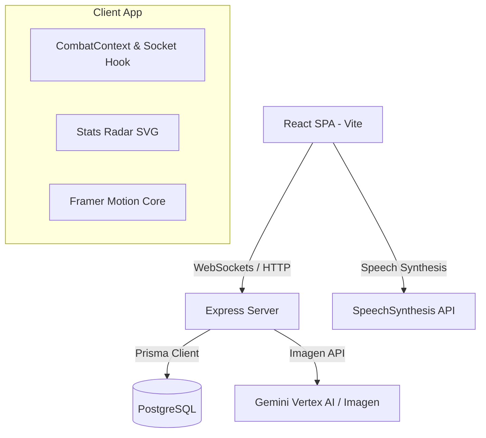

# Estrategia Técnica y Requerimientos de Implementación: Fase 5

Este documento detalla la estrategia de ingeniería, el plan de acción por fases y los requerimientos de infraestructura necesarios para llevar a cabo la **Fase 5 (Interfaz Web Premium)** del proyecto **Battle Agents**.

---

## 1. Estrategia Técnica Recomendada

Para dotar al simulador de una interfaz inmersiva y de calidad comercial sin comprometer el rendimiento del servidor y manteniendo la flexibilidad de desarrollo, se adopta la siguiente arquitectura de software:



### A. Modularización del Frontend (Desacoplamiento de App.tsx)
La refactorización de [App.tsx](file:///c:/server/proyectos/battle-agents/client/src/App.tsx) se basará en separar las responsabilidades mediante el patrón de contenedores y componentes:
- **Screens:** Cada una de las 7 pantallas (`Auth`, `Lobby`, `MapSelection`, `Draft`, `Matchmaking`, `Arena`, `Result`) se moverá a su propio archivo TypeScript.
- **State Context (`CombatContext`):** Gestionará variables compartidas (usuario autenticado, token de sesión, estado del emparejamiento, agente activo, estado de la sala actual de combate).
- **Custom Hooks (`useCombatSocket`):** Encapsulará toda la API de Socket.io, controlando los disparos de eventos de manera aislada y eliminando cierres obsoletos (*stale closures*) mediante referencias actualizadas (`useRef`).

### B. Tecnologías de Animación e Interacción
- **Framer Motion (`framer-motion`):** Reemplazará animaciones imperativas complejas. Se utilizará para orquestar la transición de entrada/salida de las pantallas mediante el componente `<AnimatePresence>` y la elevación dinámica de popups numéricos sobre las barras de salud.
- **Gráficos SVG Nativos para Radar:** En lugar de cargar librerías gráficas pesadas de terceros, utilizaremos un componente React que dibuje un polígono dinámico en base a una cuadrícula radial de 5 ejes utilizando funciones trigonométricas en base a los stats base y los multiplicadores de mapa.
- **Componentes React Lucide (`lucide-react`):** Reemplazarán la iconografía basada en emojis por iconos SVG vectoriales responsivos con colores neón adaptativos.

### C. Pipeline de Generación de Arte de Agentes por IA
Para la generación y visualización de avatares interactivos de los agentes:
1. Al crear un nuevo personaje en [CharacterCreator.ts](file:///c:/server/proyectos/battle-agents/src/core/CharacterCreator.ts), el servidor llamará al LLM para obtener la ficha y, en paralelo o inmediatamente después, ejecutará una consulta a un modelo de generación de imágenes (ej. **Gemini Imagen 3**).
2. La imagen generada se descargará temporalmente en la carpeta estática del servidor (`/public/avatars/`) y se guardará la ruta local o la URL pública en la tabla `Agent` de la base de datos PostgreSQL.
3. El frontend consumirá este recurso y lo renderizará en tarjetas de estilo holográfico utilizando efectos de rotación 3D impulsados por CSS (`transform: rotateY() rotateX()`).

---

## 2. Requerimientos Técnicos

### A. Dependencias de Node.js y React
Es necesario instalar las siguientes dependencias en la raíz del cliente y del backend:

```bash
# Dependencias del cliente (Vite + React)
cd client
npm install framer-motion lucide-react

# Dependencias del servidor (en caso de usar Vertex AI o empaquetadores de imagen)
cd ..
npm install @google/generative-ai
```

### B. Modificación del Esquema de Datos (Prisma)
Para almacenar la URL del retrato del agente, se modificará el modelo `Agent` en [schema.prisma](file:///c:/server/proyectos/battle-agents/prisma/schema.prisma):

```prisma
model Agent {
  id                     String   @id @default(uuid())
  name                   String
  gender                 String   // "hombre" o "mujer"
  archetype              String
  strength               Int
  agility                Int
  perception             Int
  resilience             Int
  intelligence           Int
  maxHp                  Int      @default(100)
  confidence             Int      @default(50)
  uniqueAbilityName      String
  uniqueAbilityDesc      String
  personalityDescription String
  imageUrl               String?  // [NUEVO] Almacena la URL del avatar generado por IA
  createdAt              DateTime @default(now())
  
  userId                 String
  user                   User     @relation(fields: [userId], references: [id], onDelete: Cascade)
  combatesAsAgent1       Combat[] @relation("Agent1Relation")
  combatesAsAgent2       Combat[] @relation("Agent2Relation")
}
```

### C. Variables de Entorno del Entorno de Ejecución
Para habilitar la generación de arte por IA, el archivo `.env` del servidor requerirá credenciales del API de Google Gemini o Vertex AI con permisos de generación de imágenes:

```env
# Clave API para generación de texto e imágenes (Gemini)
GEMINI_API_KEY="AIzaSyYourGeminiApiKeyHere"

# Ruta para guardar avatares generados
STATIC_AVATARS_DIR="./public/avatars"
```

---

## 3. Plan de Implementación Detallado

El desarrollo se ejecutará de forma incremental a través de 4 hitos específicos:

### Hito 1: Refactorización y Modularización (Día 1-2)
- [ ] Configurar el contexto global `CombatContext` y los hooks de autenticación y WebSockets.
- [ ] Separar las 7 vistas de [App.tsx](file:///c:/server/proyectos/battle-agents/client/src/App.tsx) en componentes individuales dentro de `/client/src/components/screens/`.
- [ ] Limpiar [App.tsx](file:///c:/server/proyectos/battle-agents/client/src/App.tsx) para que sólo orqueste las rutas de pantalla a través de la inyección de contextos.
- [ ] Verificar que el flujo del juego (matchmaking y arena) siga operativo tras el desacoplamiento.

### Hito 2: Gráficos de Radar y Tarjetas Holográficas (Día 3)
- [ ] Crear el componente `StatsRadarChart` en SVG para graficar los atributos del agente.
- [ ] Añadir transiciones en el radar para responder en tiempo real a los modificadores de mapa seleccionados en la pantalla de preparación.
- [ ] Diseñar el componente `AgentCard` con un estilo futurista, marcos brillantes, reflejos degradados y la integración del radar.

### Hito 3: Integración de Ilustraciones por IA en el Backend (Día 4)
- [ ] Modificar [schema.prisma](file:///c:/server/proyectos/battle-agents/prisma/schema.prisma) y aplicar cambios en PostgreSQL con `npx prisma db push`.
- [ ] Crear un servicio de generación de imágenes en el servidor (`src/providers/ImageProvider.ts`) que invoque el modelo de generación visual de Gemini a partir de la descripción narrativa del agente.
- [ ] Modificar el endpoint de creación de agentes para disparar la generación y guardar el archivo en disco (`/public/avatars/:id.png`).
- [ ] Crear una ruta de fallback para servir avatares por defecto según el arquetipo y género en caso de fallos de red o limitaciones del LLM.

### Hito 4: Log Dinámico, Efectos Visuales y Animaciones de Arena (Día 5)
- [ ] Implementar animaciones de transición entre pantallas con Framer Motion.
- [ ] Diseñar el componente `DamagePopups` para disparar etiquetas de texto flotantes ante variaciones de vida en la Arena de Combate.
- [ ] Integrar el efecto de máquina de escribir en el visor de narrativa del terminal.
- [ ] Ejecutar auditorías de accesibilidad (etiquetas ARIA para control de voz nativo) y rendimiento (carga de fuentes e imágenes).
