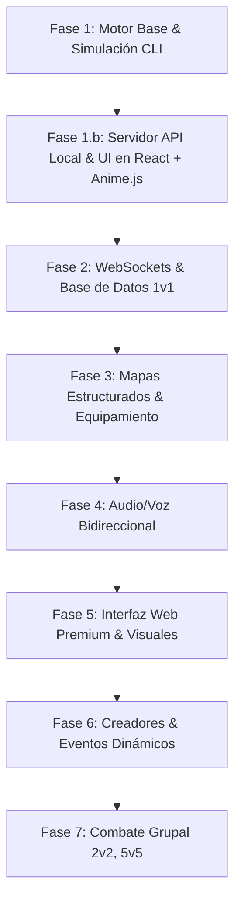

# Roadmap de Desarrollo: Battle Agents

Este documento presenta la hoja de ruta detallada para el desarrollo incremental de **Battle Agents**, desde su concepción inicial como simulador de texto hasta convertirse en un juego de rol multijugador con gráficos premium e integración de voz.

---

## Fase 1: Motor Core y Simulación de Texto (Local/CLI) [COMPLETADA]
* **Objetivo:** Validar las matemáticas de combate, la generación balanceada y la interacción con IAs sin dependencias de red o interfaces complejas.
* **Componentes clave:**
  * **Creación de Fichas (100 puntos):** Entrada de un prompt descriptivo que la IA traduce a una distribución balanceada de 100 puntos de stats base y HP inicial de 100.
  * **Abstracción de LLM:** Interfaz unificada compatible con **Ollama** (modelos locales para desarrollo económico) y **Google Gemini** (producción).
  * **Moderación (+18):** Filtro de seguridad que banea contenido sensible, penalizando la confianza del agente.
  * **Mecanismos de Continuidad (Fallbacks):** Respuestas y simulaciones predefinidas en caso de caídas de red o JSONs inválidos del LLM.
  * **Simulador CLI:** Interfaz interactiva de consola para disputar combates contra una CPU controlada por IA.

## Fase 1.b: Servidor API Local e Interfaz Web en React [COMPLETADA]
* **Objetivo:** Facilitar la lectura de la información, estados de los personajes y resultados del combate mediante una interfaz de usuario web altamente estética e interactiva.
* **Componentes clave:**
  * **Servidor Express backend:** Servidor HTTP local en Node.js para servir el frontend React compilado y exponer las rutas REST del juego.
  * **API REST de Combate:** Endpoints para crear personajes, iniciar combates y procesar rondas de juego con persistencia temporal en memoria.
  * **Frontend React (Vite + TS):** SPA moderna que organiza las pantallas del juego (Creación, Selección de Mapa, Arena de Combate).
  * **Animaciones con Anime.js:** Sacudidas de pantalla ante impactos, transiciones de valor elásticas en las barras de HP/Confianza y despliegues fluidos de estadísticas.
  * **Diseño Visual Cyberpunk/Sci-Fi:** Estilo oscuro con bordes brillantes, glassmorphism y globos de diálogo para reacciones verbales de los agentes.

## Fase 2: Servidor API, Base de Datos y WebSockets (1v1) [COMPLETADA]
* **Objetivo:** Transformar la simulación local en un juego multijugador en tiempo real.
* **Estado:** Completada e Implementada.
* **Componentes clave:**
  * **Servidor Backend:** API en Node.js (TypeScript) usando Fastify o Express.
  * **Conexión en Tiempo Real:** Integración de **Socket.io** para la sincronización del chat de combate y el envío simultáneo de turnos.
  * **Base de Datos Persistente:** Configuración de **PostgreSQL** (con Prisma ORM) para almacenar perfiles de usuario, el histórico de combates y las fichas de los personajes (acumulando el stat de Confianza).
  * **Matchmaking Básico:** Cola de espera para emparejar a dos jugadores activos en una sala de combate privada 1v1.

## Fase 3: Mapas Estructurados, Equipamiento (Boosters) y Draft [COMPLETADA]
* **Objetivo:** Profundizar en la estrategia pre-combate y la influencia táctica del entorno mediante equipamiento con límites de uso.
* **Componentes clave:**
  * **Sistema de Mapas Avanzado:** Catálogo de 5 escenarios con modificadores de atributos y tags de entorno dinámicos (Coliseo, Pantano, Fábrica, Desierto y Gravedad Cero).
  * **Sistema de Boosters (Equipamiento):** Inventario de 20 boosters divididos en Armas (activas por ataque), Partes de Armadura (cabeza, torso, brazos y piernas; pasivas que absorben daño y pierden golpes) y Herramientas (activas que curan, alteran estadísticas o confianza).
  * **Fase de Draft (Preparación):** Revelado del mapa de combate y fase de preparación de 1 minuto para que los operadores seleccionen hasta 3 boosters óptimos para la sinergia con el escenario.

## Fase 4: Audio/Voz Bidireccional
* **Objetivo:** Introducir una forma de comunicación más natural e inmersiva entre operadores y agentes.
* **Componentes clave:**
  * **Integración de Voz (STT/TTS):**
    * Los usuarios pueden hablar por micrófono (STT) y el motor interpreta la voz como prompts de combate.
    * Los agentes de IA responden con voz sintetizada (TTS) en tiempo real, reflejando su personalidad mediante tono y diálogos hablados.
    * Posibilidad de integrar modelos multimodales (ej: Gemini Multimodal Live API) para interacción directa por audio.

## Fase 5: Interfaz Web Premium (Visual & Animada)
* **Objetivo:** Sustituir la interfaz web local simple por una interfaz gráfica espectacular de nivel comercial, usando frameworks avanzados de frontend.
* **Componentes clave:**
  * **Frontend Moderno:** SPA con React, Vite o Next.js.
  * **Aesthethics:** Diseño premium con temática cyberpunk/futurista oscura, uso de gradientes brillantes, glassmorphism y fuentes tipográficas personalizadas de Google Fonts.
  * **Componentes Interactivos:**
    * Visualizador de estadísticas dinámico.
    * Log de combate animado con efectos al recibir daño o esquivar.
    * Ilustraciones de cartas de agentes generadas previamente por IA.
  * **Accesibilidad y SEO:** Optimización de carga, responsive layout y etiquetas de accesibilidad completas.

## Fase 6: Creador de Contenido y Eventos del Máster
* **Objetivo:** Dar longevidad al juego permitiendo a la comunidad expandirlo y añadiendo factores dinámicos impredecibles.
* **Componentes clave:**
  * **Editor Web de Cartas y Mapas:** Panel visual para que los usuarios creen y compartan sus propios escenarios, armas y agentes respetando las reglas de balance.
  * **Eventos del Máster de IA:** Eventos aleatorios a mitad de combate (cambios climáticos, caídas de suministros, interferencias electromagnéticas) decididos dinámicamente por la IA Máster para romper la monotonía del juego.

## Fase 7: Combate Grupal (2v2, 5v5)
* **Objetivo:** Escalar el juego a batallas tácticas de equipos.
* **Componentes clave:**
  * **Lógica por Equipos:** Gestión de iniciativas compartidas, curación a aliados, aggro y ataques coordinados entre múltiples agentes de combate.
